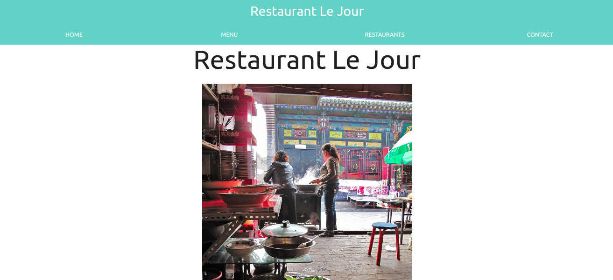

# Javascript Restaurant Page

This is a restaurant page website based on javascript, this project comes after the introduction of the ES6 class keyword, ES6 modules, and webpack. We only use JavaScript to generate the entire content of the website

## Built With

- HTML5
- JavaScript
- Materialize-CSS
- Visual Code

## Author

👤 **Gonza Javier Mancilla**

- Github: [@github/gonjavi](https://github.com/gonjavi)
- Linkedin: [linkedin](https://www.linkedin.com/in/g-javier-mancilla-a686a9178/)

## Live Demo

[Live Demo Link](https://gonjavi.github.io/JavascriptRestaurantPage/)

### Prerequisites
npm 6.13.14

### Setup

To install all dependencies from a package.json file run:

 - $npm install 
- Run on the command line: $npm run watch
- Click on: open with live server in Visual code or click on go live
- Once the browser is opened, click on dist folder and it will be ready

## 🤝 Contributing

Contributions, issues and feature requests are welcome!

## Show your support

Give a ⭐️ if you like this project!

## 📝 License

This project is [MIT](lic.url) licensed.

